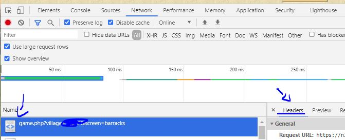

# Bot Tribal Wars (TWB)
## Otwarty bot do gry Tribal Wars

## Powiadomienie o aktualizacji 1.8
Jeśli masz problemy ze startem bota, być może będziesz musiał zaktualizować zależności, uruchamiając następującą komendę w folderze bota:
` python -m pip install --upgrade requirements.txt`

Stworzyliśmy też serwer [Discord](https://discord.gg/8PuzHjttMy), gdzie możesz poprosić o pomoc od innych użytkowników.

*Cechy:*
- Tryb kooperatywny (możesz dalej grać w przeglądarce, podczas gdy bot zarządza rzeczami w tle)
- Zarządzanie budynkami
- Zarządzanie obroną
- Zarządzanie wojskami
- Zarządzanie flagami
- Automatyczne dodawanie zdobytych wsi
- Zarządzanie farmą
- Zarządzanie targiem
- Premia targ (darmowe punkty premii :D)
- Zarządzanie badaniami (w tym systemy poziomów)
- Automatyczne tworzenie szlachty
- Zarządzanie raportami
- "Omijanie" reCaptcha poprzez użycie ciągu ciastek przeglądarki (bot działa, jeśli sesja przeglądarki jest ważna)

*Jak zacząć:*
- Zainstaluj Pythona 3.x
- Zainstaluj wymagania (pip install -r requirements.txt)
- Skopiuj config.example.json do config.json i edytuj następujące rzeczy:
	- dodaj przynajmniej endpoint i serwer
	- zmień sekcję konfiguracji village_template do swoich potrzeb
- Lub po prostu uruchom `python twb.py` i wprowadź żądane informacje

- Uruchom bota, uruchamiając python twb.py i podaj ciąg ciastek z przeglądarki
- Jeśli login się powiedzie, możesz dostosować config.json do swoich potrzeb, będzie się automatycznie przeładowywać przy zmianach.
- Twoje wsie zostaną dodane do konfiguracji automatycznie, wyłącz parametr "managed", aby bot pominął wioskę
- Dodatkowe właściwości można dostosować, uruchamiając skrypt manager.py
- Możesz ustawić agenta użytkownika bota w core/request.py na swoje własne. Prawdopodobnie nie zauważą, ale na wszelki wypadek :)

Możesz znaleźć ciąg ciastek w następującej lokalizacji (Chrome):

Musisz użyć wartości nagłówka cookie:

*opcjonalnie: Jeśli wszystko jest prawidłowo skonfigurowane i bot jest uruchomiony, możesz wejść do katalogu webmanager i uruchomić interfejs bota, uruchamiając `server.py`. Możesz uzyskać dostęp do tego pulpitu, odwiedzając http://127.0.0.1:5000/ w przeglądarce.
Wiele nowych funkcji zostanie wkrótce dodanych do pulpitu.*

Więcej informacji na temat konfiguracji bota można znaleźć w katalogu readme!
